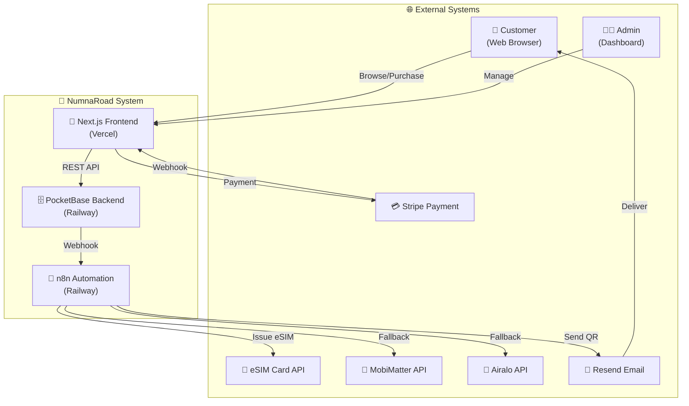
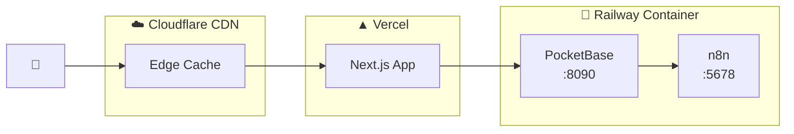
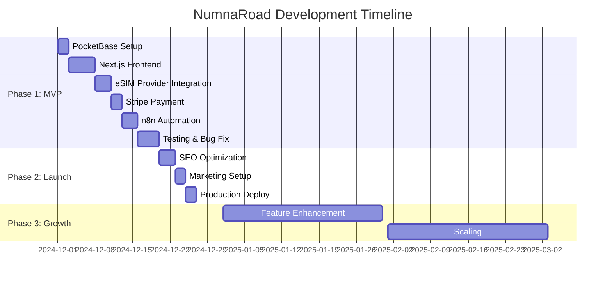

# CONTEXT.md

> **Single Source of Truth for NumnaRoad Project**
>
> 이 문서는 NumnaRoad 프로젝트의 전체 맥락을 정의합니다.
> 모든 의사결정, 설계, 구현은 이 문서에 정의된 컨텍스트를 기반으로 합니다.

## 변경 이력 (Changelog)

| 버전 | 날짜 | 작성자 | 변경 내용 |
|------|------|--------|----------|
| 1.0.0 | 2024-12-01 | @Prometheus-P | 최초 작성 |

## 관련 문서

- [README.md](../README.md) - 프로젝트 소개
- [PLANNING.md](../PLANNING.md) - 비즈니스 기획
- [ARCHITECTURE.md](../ARCHITECTURE.md) - 시스템 아키텍처

---

## 📍 1. 프로젝트 정체성

### 1.1 프로젝트 이름
**NumnaRoad** (넘나로드)

### 1.2 프로젝트 비전
> "여행자들이 전 세계 어디서나 인터넷 연결 걱정 없이 자유롭게 여행할 수 있도록 하는, 완전 자동화된 eSIM 판매 플랫폼"

### 1.3 미션 스테이트먼트
**24/7 무인 자동화를 통해 해외여행 eSIM을 10초 내에 발급하여, 여행자의 연결성을 보장하고 운영 비용은 최소화한다.**

### 1.4 북극성 지표 (North Star Metric)
**월간 자동 처리 주문 수 (Monthly Auto-Processed Orders)**

- **목표**: 월 1,000건 자동 처리 (인간 개입 0%)
- **현재 (2024-12)**: 0건 (개발 단계)
- **1차 목표 (2025-03)**: 월 300건 (손익분기점)
- **2차 목표 (2025-06)**: 월 500건
- **3차 목표 (2025-12)**: 월 1,000건

---

## 🎯 2. 문제 정의 (Problem Statement)

### 2.1 해결하려는 문제

**Primary Problem:**
해외여행자들은 현지에서 인터넷을 사용하기 위해 복잡한 로밍 설정이나 현지 유심 구매 과정을 겪어야 한다.

**Secondary Problem:**
기존 eSIM 판매 업체들은 수동 처리로 인해:
- 야간/주말 판매 불가 (기회 손실 30%)
- 인건비 부담 (월 300만원+)
- 처리 시간 지연 (평균 10분)
- 확장성 제약 (하루 최대 48건)

### 2.2 타겟 고객

#### 2.2.1 1차 타겟: 해외여행 한국인 (비주류 지역)

**페르소나: "디지털 노마드 현수" (28세, 개발자)**
- **여행 스타일**: 장기 체류 (1-3개월), 코워킹 스페이스
- **목적지**: 조지아, 포르투갈, 발리, 치앙마이
- **니즈**: 안정적 속도 (화상회의), 장기 플랜 (30-60일)
- **지불 의사**: 높음 (월 10-20만원)
- **구매 채널**: 디지털 노마드 커뮤니티, 블로그

**페르소나: "배낭여행 민지" (25세, 대학원생)**
- **여행 스타일**: 3개월 남미 종주, 1개월 동유럽
- **목적지**: 볼리비아, 페루, 루마니아, 불가리아
- **니즈**: 멀티국가 플랜, 저렴한 가격, 한국어 가이드
- **지불 의사**: 중간 (여행 예산의 5%)
- **구매 채널**: 네이버 카페, 인스타그램

#### 2.2.2 2차 타겟: 한국 방문 외국인

**페르소나: "관광객 Yuki" (30세, 일본)**
- **여행 목적**: 3박 4일 서울 관광
- **니즈**: 공항 도착 즉시 사용, 카카오톡/지도 원활
- **지불 의사**: 높음 (편의성 중시)
- **구매 채널**: 구글 검색, 트립어드바이저

### 2.3 시장 크기

- **글로벌 eSIM 시장**: 2024년 $4.7B → 2030년 $16.3B (CAGR 23%)
- **한국 해외여행객**: 연간 2,800만명 (월 233만명)
- **한국 방문 외국인**: 연간 1,100만명 (월 92만명)
- **eSIM 인지도**: 30% (2022년 10% → 2024년 30%)

**TAM (Total Addressable Market):**
- 한국인 해외여행 × eSIM 인지도 × 구매 전환율
- 233만명/월 × 30% × 5% = 35,000건/월 (잠재 시장)

**SAM (Serviceable Addressable Market):**
- 비주류 지역 여행자 (전체의 10%)
- 35,000건 × 10% = 3,500건/월

**SOM (Serviceable Obtainable Market):**
- 1년차 목표 점유율 10%
- 3,500건 × 10% = 350건/월

---

## 💡 3. 솔루션 개요

### 3.1 핵심 가치 제안 (Unique Value Proposition)

**"10초 내 eSIM 자동 발급 + 니치 지역 특화 + 24/7 무인 운영"**

| 기능 | 기존 업체 | NumnaRoad | 차별점 |
|------|----------|-----------|--------|
| 발급 시간 | 10분 (수동) | 10초 (자동) | **60배 빠름** |
| 운영 시간 | 09:00-18:00 | 24/7 | **야간 매출 +30%** |
| 지원 지역 | 주류 (일본, 동남아) | 비주류 포함 | **경쟁 회피** |
| 인건비 | 월 300만원 | 월 0원 | **순이익 +40%** |
| 확장성 | 하루 48건 | 무제한 | **100배 확장** |

### 3.2 핵심 기능

#### 3.2.1 자동 주문 처리
```
고객 결제 완료
→ Stripe Webhook
→ PocketBase Order 생성
→ n8n Trigger
→ eSIM 공급사 API 호출
→ QR 코드 수신
→ 고객 이메일 발송
→ 완료 (총 소요시간: 10초)
```

#### 3.2.2 공급사 자동 전환
- 1차 공급사 (eSIM Card) 실패 시 → 2차 (MobiMatter) 자동 전환
- 2차 실패 시 → 3차 (Airalo) 자동 전환
- 모두 실패 시 → Slack 알림 + 자동 환불

#### 3.2.3 실시간 재고 관리
- Cron Job: 1시간마다 공급사 재고 동기화
- 재고 10개 이하 → Slack 알림
- 재고 0개 → 자동 상품 비활성화

#### 3.2.4 마케팅 자동화
- 구매 완료 → 즉시 환영 이메일 + 사용법
- D+7 → 만족도 조사 + 리뷰 요청
- D+30 → 재구매 쿠폰 10% 발송
- 장바구니 이탈 → 1시간 후 리마인더

---

## 🏗️ 4. 시스템 컨텍스트

### 4.1 시스템 경계



### 4.2 기술 스택

| 레이어 | 기술 | 선택 이유 |
|--------|------|----------|
| **Frontend** | Next.js 14 (App Router) | SSR/ISR, SEO 최적화, Vercel 무료 배포 |
| **UI** | TailwindCSS + shadcn/ui | 빠른 프로토타이핑, 접근성 내장 |
| **State** | React Query (TanStack) | 자동 재시도, 캐싱, 낙관적 업데이트 |
| **Backend** | PocketBase (Go) | 단일 바이너리, Admin UI 내장, 무료 |
| **Database** | SQLite (내장) | 제로 설정, 충분한 성능 (~10k TPS) |
| **Automation** | n8n (자체 호스팅) | 무료, 시각적 워크플로우, Webhook 지원 |
| **Payment** | Stripe | 글로벌 표준, 한국 카드 지원 |
| **Email** | Resend | 월 3,000건 무료, 간단한 API |
| **Hosting** | Railway | $5/월, PocketBase+n8n 동시 호스팅 |
| **CDN** | Cloudflare | 무료, 글로벌 엣지 네트워크 |

### 4.3 배포 아키텍처



**월간 비용:**
- Vercel: $0 (Hobby 플랜)
- Railway: $5 (Starter 플랜)
- Cloudflare: $0 (Free 플랜)
- **총 $5/월** (순이익률 최대화)

---

## 🔑 5. 핵심 제약사항 (Constraints)

### 5.1 비즈니스 제약

| 제약 | 이유 | 영향 |
|------|------|------|
| **예산**: 초기 투자 500만원 이하 | 부트스트랩, 외부 투자 없음 | 무료/저비용 기술 스택 우선 |
| **인력**: 1인 개발 | 솔로 프리랜서 | 단순한 아키텍처, 자동화 극대화 |
| **시간**: 6주 내 MVP | 시장 진입 속도 | 최소 기능 집합 (MoSCoW) |
| **운영비**: 월 $10 이하 | 손익분기 빠른 달성 | 서버리스/매니지드 서비스 |

### 5.2 기술 제약

| 제약 | 이유 | 대응 |
|------|------|------|
| **복잡도**: 마이크로서비스 불가 | 운영 오버헤드 | 모놀리식 구조 |
| **DB**: PostgreSQL 불가 | 인프라 비용 | SQLite (월 1만건 충분) |
| **백엔드 개발**: 최소화 | 빠른 개발 | PocketBase 활용 |
| **DevOps**: CI/CD 단순화 | 시간 절약 | Railway 자동 배포 |

### 5.3 법적/규정 제약

| 항목 | 요구사항 | 준수 방법 |
|------|----------|----------|
| **개인정보보호법** | 이메일, 주문 정보 암호화 | PocketBase 내장 암호화 |
| **전자상거래법** | 환불 정책, 약관 명시 | 구매 전 약관 동의 체크박스 |
| **통신판매업** | 사업자등록증 필요 | 개인사업자 등록 |

---

## 📊 6. 성공 지표 (Success Metrics)

### 6.1 핵심 지표 (North Star + Supporting)

| 지표 | 정의 | 목표 (3개월) | 측정 방법 |
|------|------|-------------|----------|
| **주문 자동 처리율** | 인간 개입 없이 완료된 주문 비율 | 95% 이상 | PocketBase logs |
| **평균 발급 시간** | 결제 → 이메일 발송 시간 | 30초 이하 | n8n execution logs |
| **월 순이익** | 매출 - (매입 + 운영비) | 60만원 이상 | Stripe dashboard |
| **고객 만족도** | 리뷰 평균 별점 | 4.5/5 이상 | PocketBase reviews |
| **재구매율** | 2회 이상 구매 고객 비율 | 20% 이상 | User analytics |

### 6.2 운영 지표

| 지표 | 목표 | 알림 임계값 |
|------|------|-----------|
| **API 응답 시간** | p95 < 2초 | p95 > 3초 |
| **에러율** | < 1% | > 2% |
| **공급사 장애 대응 시간** | < 5초 (자동 전환) | > 10초 |
| **시스템 가동률** | > 99.5% | < 99% |

---

## 🚧 7. 범위 정의 (Scope)

### 7.1 In-Scope (MVP에 포함)

#### Must Have (필수)
- ✅ 상품 목록 페이지 (국가별 필터)
- ✅ 상품 상세 페이지 (설치 가이드 포함)
- ✅ Stripe 결제 통합
- ✅ 자동 주문 처리 (결제 → eSIM 발급 → 이메일)
- ✅ PocketBase Admin UI 활용
- ✅ 3개 eSIM 공급사 연동 (자동 전환)
- ✅ 기본 에러 핸들링 (Slack 알림)

#### Should Have (중요)
- 🟡 회원가입/로그인
- 🟡 주문 내역 조회
- 🟡 마케팅 이메일 자동화 (D+7, D+30)
- 🟡 쿠폰 시스템
- 🟡 SEO 최적화 (메타태그, 사이트맵)

### 7.2 Out-of-Scope (MVP 이후)

#### Could Have (나중에 가능)
- ⚪ 리뷰 시스템
- ⚪ 포인트/리워드 프로그램
- ⚪ 다국어 지원 (영어, 중국어, 일본어)
- ⚪ 모바일 앱 (React Native)

#### Won't Have (현 단계에서 제외)
- ❌ B2B API (리셀러 프로그램)
- ❌ AI 챗봇 고객 지원
- ❌ 동적 가격 책정
- ❌ 구독 모델

---

## 🎬 8. 프로젝트 일정

### 8.1 마일스톤



### 8.2 위험 요소 (Risks)

| 위험 | 확률 | 영향 | 완화 전략 |
|------|------|------|----------|
| **공급사 API 변경** | 중 | 높음 | 3개 공급사 병렬 운영 |
| **결제 시스템 장애** | 낮음 | 높음 | Stripe Webhook 재시도 로직 |
| **트래픽 급증** | 중 | 중 | Cloudflare CDN, Railway 자동 스케일링 |
| **보안 취약점** | 낮음 | 높음 | OWASP Top 10 체크리스트 |
| **법적 이슈** | 낮음 | 높음 | 전자상거래법 준수, 약관 명시 |

---

## 📝 9. 의사결정 기록 (Key Decisions)

### 9.1 아키텍처 결정

| 결정 | 선택 | 대안 | 선택 이유 |
|------|------|------|----------|
| **백엔드** | PocketBase | Supabase, Firebase | 제로 비용, Admin UI 내장, 단일 바이너리 |
| **프론트엔드** | Next.js 14 | Remix, Astro | SSR/ISR, SEO 최적화, Vercel 무료 |
| **자동화** | n8n | Zapier, Make | 무료, 자체 호스팅, 무제한 워크플로우 |
| **결제** | Stripe | 토스페이먼츠 | 글로벌 표준, 한국 카드 지원, 문서 풍부 |
| **DB** | SQLite | PostgreSQL | 제로 설정, 충분한 성능 (월 1만건) |
| **호스팅** | Railway | AWS, GCP | $5/월, 자동 배포, 초보자 친화적 |

### 9.2 비즈니스 결정

| 결정 | 선택 | 이유 |
|------|------|------|
| **타겟 시장** | 비주류 지역 우선 | 경쟁 회피, 니치 선점 |
| **가격 전략** | 중간 가격 (마진 33%) | 품질 대비 합리적, 재구매 유도 |
| **마케팅** | 콘텐츠 + SEO 중심 | 저비용, 장기적 효과 |
| **확장 전략** | 인바운드 시장 (2차) | 1차 시장 안정 후 진출 |

---

## 🔗 10. 관련 문서 맵

```
CONTEXT.md (현재 문서)
    │
    ├─── README.md (프로젝트 소개)
    │
    ├─── docs/specs/
    │       ├─── PRD.md (제품 요구사항)
    │       ├─── ARCHITECTURE.md (시스템 설계)
    │       ├─── API_SPEC.md (API 명세)
    │       └─── DATA_MODEL.md (DB 스키마)
    │
    ├─── docs/guides/
    │       ├─── TDD_GUIDE.md (TDD 사이클)
    │       └─── CLEAN_CODE_GUIDE.md (코딩 규칙)
    │
    └─── docs/business/
            ├─── PLANNING.md (비즈니스 기획)
            └─── COST_MODEL.md (비용 구조)
```

---

## ✅ VALIDATION CHECKLIST

- [x] 프로젝트 비전이 명확히 정의됨
- [x] 타겟 고객이 페르소나로 구체화됨
- [x] 시장 크기가 TAM/SAM/SOM으로 산정됨
- [x] 핵심 가치 제안이 차별화됨
- [x] 시스템 경계가 다이어그램으로 시각화됨
- [x] 기술 스택 선택 이유가 명확함
- [x] 제약사항이 실행 가능한 수준으로 정의됨
- [x] 성공 지표가 측정 가능함
- [x] 범위가 MoSCoW로 명확히 구분됨
- [x] 프로젝트 일정이 현실적임
- [x] 의사결정 근거가 문서화됨

---

**이 문서는 NumnaRoad 프로젝트의 모든 의사결정과 구현의 기준이 됩니다.**
**변경 시 반드시 버전 관리 및 변경 이력을 업데이트하십시오.**
