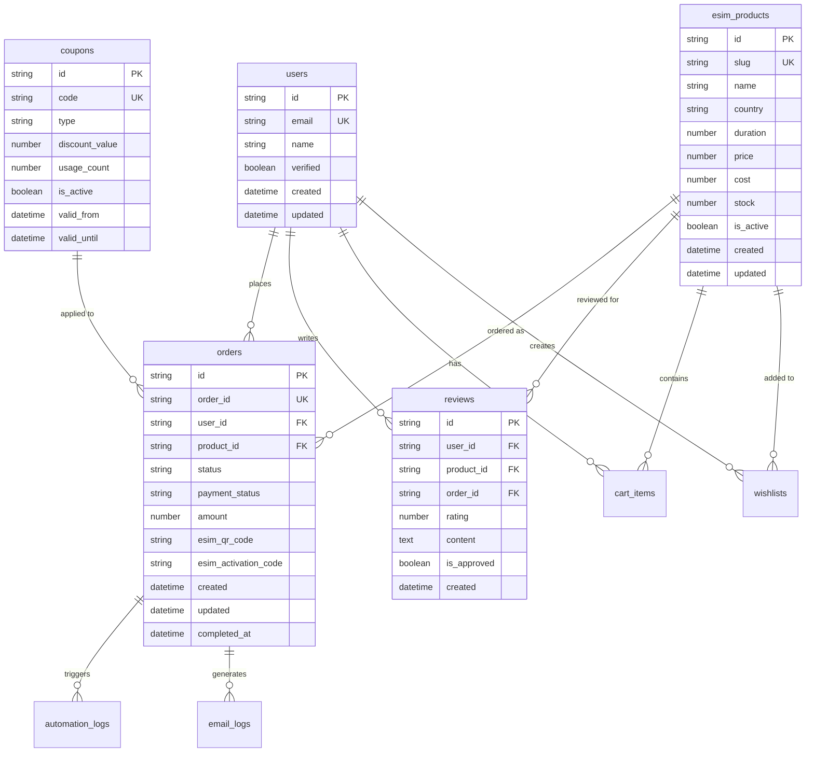

# Data Model & Database Design

NumnaRoad 데이터 모델 및 데이터베이스 설계 명세서

---

## 📋 Document Metadata

| 항목 | 내용 |
|------|------|
| **문서 유형** | Data Specification |
| **대상 독자** | Backend 개발자, Database 엔지니어, QA |
| **최종 수정** | 2024-12-01 |
| **DB 버전** | 1.0.0 |
| **연관 문서** | [PRD.md](./PRD.md), [API_SPEC.md](./API_SPEC.md), [DATABASE_SCHEMA.md](./docs/DATABASE_SCHEMA.md) |
| **우선순위** | ⭐⭐⭐ (Core) |

---

## 📚 Quick Links

- 📋 **[PRD.md](./PRD.md)** - Product Requirements
- 📡 **[API_SPEC.md](./API_SPEC.md)** - API Specification
- 🗄️ **[DATABASE_SCHEMA.md](./docs/DATABASE_SCHEMA.md)** - Detailed Schema
- 🏗️ **[ARCHITECTURE.md](./ARCHITECTURE.md)** - System Architecture

---

## 목차

1. [Data Model Overview](#data-model-overview)
2. [Entity Relationship Diagram](#entity-relationship-diagram)
3. [Core Entities](#core-entities)
4. [Data Validation Rules](#data-validation-rules)
5. [Index Strategy](#index-strategy)
6. [Query Optimization](#query-optimization)
7. [Data Integrity](#data-integrity)
8. [Data Migration](#data-migration)
9. [Backup Strategy](#backup-strategy)
10. [Performance Tuning](#performance-tuning)

---

## Data Model Overview

### Database System

**PocketBase (SQLite)**

- **Type**: Embedded relational database
- **Storage**: Single file (data.db)
- **Max Size**: ~140TB (theoretical), 1GB (practical for our use case)
- **ACID**: Fully ACID-compliant
- **Concurrency**: Multiple readers, single writer

### Design Principles

1. **Normalization**: 3NF (Third Normal Form)
2. **Denormalization**: Strategic for read-heavy queries
3. **Soft Delete**: No physical deletion of critical data
4. **Audit Trail**: created/updated timestamps on all tables
5. **Referential Integrity**: Foreign keys with cascade rules

### Data Categories

| Category | Collections | Purpose |
|----------|-------------|---------|
| **Core Business** | esim_products, orders | Product catalog and order management |
| **User Management** | users, customers | Authentication and customer profiles |
| **Marketing** | coupons, reviews, wishlists | Promotions and customer engagement |
| **Operations** | automation_logs, email_logs, provider_sync_logs | System monitoring and debugging |
| **Transient** | cart_items | Short-lived session data |

---

## Entity Relationship Diagram

### Core ERD (Mermaid)



### Detailed Relationships

#### 1:N Relationships

```
users (1) ───────< (N) orders
  - One user can have many orders
  - Foreign Key: orders.user → users.id
  - Cascade: ON DELETE SET NULL (preserve order history)

esim_products (1) ───────< (N) orders
  - One product can be in many orders
  - Foreign Key: orders.product → esim_products.id
  - Cascade: ON DELETE RESTRICT (cannot delete product with orders)

users (1) ───────< (N) reviews
  - One user can write many reviews
  - Foreign Key: reviews.user → users.id
  - Cascade: ON DELETE CASCADE

esim_products (1) ───────< (N) reviews
  - One product can have many reviews
  - Foreign Key: reviews.product → esim_products.id
  - Cascade: ON DELETE CASCADE

orders (1) ───────< (N) automation_logs
  - One order can have many automation logs
  - Foreign Key: automation_logs.order → orders.id
  - Cascade: ON DELETE CASCADE
```

#### M:N Relationships

```
coupons (M) ←──→ (N) orders
  - Implemented via orders.coupon_id (simplified)
  - Many coupons can be used in many orders
  - One order can use one coupon (business rule)
```

---

## Core Entities

### 1. esim_products

**Purpose**: Product catalog for eSIM offerings

**Schema**:

| Field | Type | Constraints | Description |
|-------|------|-------------|-------------|
| `id` | string | PK, Auto | Unique identifier |
| `name` | string | Required, Max 200 | Product display name |
| `slug` | string | Unique, Required | URL-friendly identifier |
| `country` | string | Required | ISO 3166-1 alpha-2 code |
| `duration` | integer | Required, Min 1 | Validity period in days |
| `data_limit` | string | Required | e.g., "Unlimited", "10GB" |
| `price` | decimal(10,2) | Required, Min 0 | Retail price in USD |
| `cost` | decimal(10,2) | Required, Min 0 | Wholesale cost in USD |
| `margin_percent` | decimal(5,2) | Computed | (price - cost) / cost * 100 |
| `currency` | string | Default "USD" | ISO 4217 code |
| `provider` | enum | Required | "eSIM Card", "MobiMatter", "Airalo" |
| `provider_product_id` | string | Required | Provider's SKU |
| `stock` | integer | Default 0, Min 0 | Available inventory |
| `is_active` | boolean | Default true | Visibility in storefront |
| `is_featured` | boolean | Default false | Featured on homepage |
| `image_url` | string | Optional | Product image URL |
| `description` | text | Optional | HTML description |
| `features` | json | Optional | Array of feature strings |
| `supported_networks` | json | Optional | Array of network names |
| `sort_order` | integer | Default 0 | Display order |
| `created` | datetime | Auto | Creation timestamp |
| `updated` | datetime | Auto | Last update timestamp |

**Business Rules**:

1. `price` must be greater than `cost`
2. `slug` must match pattern: `^[a-z0-9]+(?:-[a-z0-9]+)*$` (kebab-case)
3. `stock = 0` → auto-set `is_active = false`
4. `country` must be valid ISO code
5. Cannot delete product if referenced in orders

**Indexes**:
```sql
CREATE INDEX idx_products_country_active ON esim_products(country, is_active);
CREATE INDEX idx_products_featured ON esim_products(is_featured, sort_order);
CREATE UNIQUE INDEX idx_products_slug ON esim_products(slug);
```

### 2. orders

**Purpose**: Order tracking and fulfillment

**Schema**:

| Field | Type | Constraints | Description |
|-------|------|-------------|-------------|
| `id` | string | PK, Auto | Unique identifier |
| `order_id` | string | Unique, Required | UUID |
| `user` | string | FK(users), Nullable | User ID (nullable for guests) |
| `product` | string | FK(esim_products), Required | Product ID |
| `status` | enum | Required | pending, processing, completed, failed, refunded |
| `payment_status` | enum | Required | pending, paid, failed, refunded |
| `payment_method` | enum | Required | card, paypal, bank_transfer |
| `payment_id` | string | Required | Stripe payment_intent_id |
| `payment_receipt_url` | string | Optional | Receipt URL from gateway |
| `amount` | decimal(10,2) | Required, Min 0 | Payment amount |
| `currency` | string | Default "USD" | ISO 4217 code |
| `discount_amount` | decimal(10,2) | Default 0 | Coupon discount |
| `coupon_id` | string | FK(coupons), Nullable | Applied coupon |
| `esim_qr_code` | string | Nullable | File path to QR image |
| `esim_qr_code_url` | string | Nullable | External QR code URL |
| `esim_activation_code` | string | Nullable | LPA activation code |
| `esim_iccid` | string | Nullable | eSIM ICCID |
| `provider_order_id` | string | Nullable | Provider's order reference |
| `customer_email` | string | Required, Email | Customer email |
| `customer_name` | string | Optional | Customer full name |
| `customer_phone` | string | Optional | Customer phone |
| `delivered_at` | datetime | Nullable | eSIM issuance time |
| `email_sent_at` | datetime | Nullable | Email delivery time |
| `error_message` | text | Nullable | Error details if failed |
| `retry_count` | integer | Default 0 | Retry attempts |
| `ip_address` | string | Optional | Customer IP |
| `user_agent` | string | Optional | Browser user agent |
| `utm_source` | string | Optional | Marketing source |
| `utm_medium` | string | Optional | Marketing medium |
| `utm_campaign` | string | Optional | Campaign identifier |
| `created` | datetime | Auto | Order creation time |
| `updated` | datetime | Auto | Last update time |
| `completed_at` | datetime | Nullable | Fulfillment completion time |

**State Machine**:

```
┌─────────┐
│ pending │ (Initial state after payment)
└────┬────┘
     │
     v
┌────────────┐
│ processing │ (eSIM provider API called)
└─────┬──────┘
      │
      ├─────> ✅ completed (QR code received, email sent)
      │
      └─────> ❌ failed (all providers failed)
                    │
                    └─────> refunded (auto-refund processed)
```

**Status Transitions**:

| From | To | Trigger | Auto/Manual |
|------|----|---------| ------------|
| pending | processing | n8n workflow starts | Auto |
| processing | completed | eSIM issued successfully | Auto |
| processing | failed | All providers failed | Auto |
| failed | refunded | Refund API called | Auto |
| completed | refunded | Customer request | Manual |

**Business Rules**:

1. `order_id` must be unique UUID
2. `status` can only transition forward (no rollback)
3. `completed_at` is set when `status` → completed
4. `payment_status` = paid required before processing
5. Cannot delete orders (soft delete only via status)

**Indexes**:
```sql
CREATE UNIQUE INDEX idx_orders_order_id ON orders(order_id);
CREATE INDEX idx_orders_user_created ON orders(user, created DESC);
CREATE INDEX idx_orders_status ON orders(status);
CREATE INDEX idx_orders_payment_status ON orders(payment_status);
CREATE INDEX idx_orders_customer_email ON orders(customer_email);
```

### 3. coupons

**Purpose**: Discount code management

**Schema**:

| Field | Type | Constraints | Description |
|-------|------|-------------|-------------|
| `id` | string | PK, Auto | Unique identifier |
| `code` | string | Unique, Required | Coupon code (uppercase) |
| `type` | enum | Required | "percentage", "fixed" |
| `discount_value` | decimal(10,2) | Required | Percentage (0-100) or fixed amount |
| `min_purchase_amount` | decimal(10,2) | Nullable | Minimum order amount |
| `max_discount_amount` | decimal(10,2) | Nullable | Maximum discount cap |
| `usage_limit` | integer | Nullable | Total usage limit (null = unlimited) |
| `usage_count` | integer | Default 0 | Current usage count |
| `user_usage_limit` | integer | Default 1 | Per-user limit |
| `applicable_products` | json | Nullable | Array of product IDs (null = all) |
| `applicable_countries` | json | Nullable | Array of country codes (null = all) |
| `is_active` | boolean | Default true | Active status |
| `valid_from` | datetime | Required | Start date/time |
| `valid_until` | datetime | Nullable | Expiration date/time |
| `description` | text | Optional | Internal notes |
| `created` | datetime | Auto | Creation time |
| `updated` | datetime | Auto | Last update time |

**Validation Logic**:

```typescript
function validateCoupon(
  coupon: Coupon,
  order: { amount: number; productId: string; country: string }
): { valid: boolean; discountAmount: number; error?: string } {
  // 1. Active check
  if (!coupon.is_active) {
    return { valid: false, discountAmount: 0, error: "Coupon is inactive" };
  }

  // 2. Date range check
  const now = new Date();
  if (coupon.valid_from && now < new Date(coupon.valid_from)) {
    return { valid: false, discountAmount: 0, error: "Coupon not yet valid" };
  }
  if (coupon.valid_until && now > new Date(coupon.valid_until)) {
    return { valid: false, discountAmount: 0, error: "Coupon expired" };
  }

  // 3. Usage limit check
  if (coupon.usage_limit && coupon.usage_count >= coupon.usage_limit) {
    return { valid: false, discountAmount: 0, error: "Coupon usage limit reached" };
  }

  // 4. Minimum purchase check
  if (coupon.min_purchase_amount && order.amount < coupon.min_purchase_amount) {
    return { valid: false, discountAmount: 0, error: `Minimum purchase $${coupon.min_purchase_amount} required` };
  }

  // 5. Product applicability
  if (coupon.applicable_products && !coupon.applicable_products.includes(order.productId)) {
    return { valid: false, discountAmount: 0, error: "Coupon not applicable to this product" };
  }

  // 6. Country applicability
  if (coupon.applicable_countries && !coupon.applicable_countries.includes(order.country)) {
    return { valid: false, discountAmount: 0, error: "Coupon not applicable to this country" };
  }

  // 7. Calculate discount
  let discountAmount = 0;
  if (coupon.type === 'percentage') {
    discountAmount = (order.amount * coupon.discount_value) / 100;
  } else {
    discountAmount = coupon.discount_value;
  }

  // 8. Apply max discount cap
  if (coupon.max_discount_amount) {
    discountAmount = Math.min(discountAmount, coupon.max_discount_amount);
  }

  return { valid: true, discountAmount };
}
```

**Indexes**:
```sql
CREATE UNIQUE INDEX idx_coupons_code ON coupons(code);
CREATE INDEX idx_coupons_active ON coupons(is_active, valid_until);
```

### 4. reviews

**Purpose**: Customer reviews and ratings

**Schema**:

| Field | Type | Constraints | Description |
|-------|------|-------------|-------------|
| `id` | string | PK, Auto | Unique identifier |
| `order` | string | FK(orders), Required | Order reference |
| `user` | string | FK(users), Required | Reviewer |
| `product` | string | FK(esim_products), Required | Product reviewed |
| `rating` | integer | Required, Min 1, Max 5 | Star rating |
| `title` | string | Optional, Max 100 | Review headline |
| `content` | text | Required, Max 1000 | Review text |
| `images` | json | Optional | Array of image URLs |
| `is_verified` | boolean | Auto-computed | Verified purchase |
| `is_approved` | boolean | Default false | Admin moderation |
| `helpful_count` | integer | Default 0 | Helpful votes |
| `created` | datetime | Auto | Review date |
| `updated` | datetime | Auto | Last edit date |

**Business Rules**:

1. One review per user per product
2. `is_verified` = true if order.status = completed
3. Only approved reviews visible publicly
4. Users can edit own reviews within 24 hours
5. Rating average cached on product

**Indexes**:
```sql
CREATE INDEX idx_reviews_product_approved ON reviews(product, is_approved);
CREATE INDEX idx_reviews_user ON reviews(user);
CREATE UNIQUE INDEX idx_reviews_user_product ON reviews(user, product);
```

---

## Data Validation Rules

### Field Validation

```typescript
// Centralized validation rules
const ValidationRules = {
  email: {
    pattern: /^[^\s@]+@[^\s@]+\.[^\s@]+$/,
    message: "Invalid email format",
  },
  phone: {
    pattern: /^\+?[1-9]\d{1,14}$/,
    message: "Invalid phone format (E.164)",
  },
  slug: {
    pattern: /^[a-z0-9]+(?:-[a-z0-9]+)*$/,
    message: "Invalid slug format (kebab-case only)",
  },
  couponCode: {
    pattern: /^[A-Z0-9]{6,12}$/,
    message: "Coupon code must be 6-12 uppercase alphanumeric characters",
  },
  currency: {
    enum: ["USD", "KRW", "EUR", "JPY"],
    message: "Invalid currency code",
  },
  countryCode: {
    pattern: /^[A-Z]{2}$/,
    message: "Invalid ISO 3166-1 alpha-2 country code",
  },
};
```

### Constraint Enforcement

```sql
-- PocketBase field validation (JavaScript)
{
  "name": "email",
  "type": "email",
  "required": true,
  "options": {
    "pattern": "^[^\\s@]+@[^\\s@]+\\.[^\\s@]+$",
    "exceptDomains": ["tempmail.com", "guerrillamail.com"]
  }
}

{
  "name": "price",
  "type": "number",
  "required": true,
  "options": {
    "min": 0,
    "max": 10000,
    "noDecimal": false
  }
}

{
  "name": "country",
  "type": "select",
  "required": true,
  "options": {
    "maxSelect": 1,
    "values": ["JP", "KR", "US", "CN", "TH", "VN", "GE", "BO"]
  }
}
```

---

## Index Strategy

### Index Types

1. **Primary Key**: Unique identifier (auto-indexed)
2. **Unique Index**: Enforce uniqueness (slug, email)
3. **Composite Index**: Multi-column queries (country + is_active)
4. **Covering Index**: Include frequently accessed columns

### Index Analysis

```sql
-- Query: Get active products by country
SELECT * FROM esim_products
WHERE country = 'JP' AND is_active = true
ORDER BY sort_order;

-- Optimal index:
CREATE INDEX idx_products_country_active_sort
ON esim_products(country, is_active, sort_order);
```

### Index Maintenance

```bash
# Analyze query performance
sqlite3 pb_data/data.db "EXPLAIN QUERY PLAN SELECT * FROM esim_products WHERE country='JP';"

# Rebuild indexes (if fragmented)
sqlite3 pb_data/data.db "REINDEX;"

# Vacuum database (reclaim space)
sqlite3 pb_data/data.db "VACUUM;"
```

---

## Query Optimization

### N+1 Query Problem

**❌ Bad (N+1 queries)**:
```typescript
const orders = await pb.collection('orders').getList(1, 10);
for (const order of orders.items) {
  const product = await pb.collection('esim_products').getOne(order.product);
  // N additional queries
}
```

**✅ Good (Single query with expand)**:
```typescript
const orders = await pb.collection('orders').getList(1, 10, {
  expand: 'product,user',
});
// Product and user data included in response
```

### Pagination

```typescript
// Efficient pagination with cursor
async function getOrdersCursor(cursor?: string, limit = 30) {
  const filter = cursor
    ? `created < '${cursor}'`
    : '';

  const orders = await pb.collection('orders').getList(1, limit, {
    filter,
    sort: '-created',
  });

  return {
    items: orders.items,
    nextCursor: orders.items[orders.items.length - 1]?.created,
    hasMore: orders.totalItems > orders.items.length,
  };
}
```

### Caching Strategy

```typescript
// Redis cache for expensive queries
async function getProductWithCache(productId: string) {
  const cacheKey = `product:${productId}`;

  // Try cache first
  const cached = await redis.get(cacheKey);
  if (cached) return JSON.parse(cached);

  // Fetch from DB
  const product = await pb.collection('esim_products').getOne(productId);

  // Cache for 5 minutes
  await redis.setex(cacheKey, 300, JSON.stringify(product));

  return product;
}
```

---

## Data Integrity

### Referential Integrity

```javascript
// PocketBase cascade rules (orders collection)
{
  "name": "product",
  "type": "relation",
  "required": true,
  "options": {
    "collectionId": "esim_products",
    "cascadeDelete": false,  // RESTRICT: Cannot delete product with orders
    "maxSelect": 1,
    "displayFields": ["name", "country"]
  }
}

{
  "name": "user",
  "type": "relation",
  "required": false,
  "options": {
    "collectionId": "users",
    "cascadeDelete": false,  // SET NULL: Preserve order history
    "maxSelect": 1
  }
}
```

### Data Consistency Checks

```typescript
// Periodic consistency checks (daily cron)
async function runConsistencyChecks() {
  // 1. Check orphaned orders
  const orphanedOrders = await pb.collection('orders').getList(1, 100, {
    filter: 'product = "" || product = null',
  });
  if (orphanedOrders.totalItems > 0) {
    console.warn(`Found ${orphanedOrders.totalItems} orphaned orders`);
  }

  // 2. Check stock consistency
  const products = await pb.collection('esim_products').getList(1, 1000, {
    filter: 'stock < 0',
  });
  if (products.totalItems > 0) {
    console.error(`Found ${products.totalItems} products with negative stock`);
  }

  // 3. Check completed orders without eSIM data
  const incompleteOrders = await pb.collection('orders').getList(1, 100, {
    filter: 'status="completed" && (esim_qr_code="" || esim_activation_code="")',
  });
  if (incompleteOrders.totalItems > 0) {
    console.error(`Found ${incompleteOrders.totalItems} completed orders without eSIM data`);
  }
}
```

---

## Data Migration

### Version 1.0 → 1.1 (Add Coupons)

```javascript
// pb_migrations/1701234567_add_coupons.js
migrate((db) => {
  const collection = $app.dao().findCollectionByNameOrId("coupons");

  if (!collection) {
    // Create coupons collection
    const newCollection = new Collection({
      name: "coupons",
      type: "base",
      schema: [
        {
          name: "code",
          type: "text",
          required: true,
          options: { min: 6, max: 12, pattern: "^[A-Z0-9]+$" },
        },
        {
          name: "type",
          type: "select",
          required: true,
          options: { values: ["percentage", "fixed"] },
        },
        {
          name: "discount_value",
          type: "number",
          required: true,
          options: { min: 0 },
        },
        {
          name: "usage_limit",
          type: "number",
          options: { min: 0 },
        },
        {
          name: "usage_count",
          type: "number",
          options: { min: 0 },
        },
        {
          name: "is_active",
          type: "bool",
        },
        {
          name: "valid_from",
          type: "date",
          required: true,
        },
        {
          name: "valid_until",
          type: "date",
        },
      ],
      indexes: [
        "CREATE UNIQUE INDEX idx_coupons_code ON coupons(code)",
      ],
    });

    $app.dao().saveCollection(newCollection);
  }

  // Add coupon_id field to orders collection
  const orders = $app.dao().findCollectionByNameOrId("orders");
  orders.schema.addField({
    name: "coupon_id",
    type: "relation",
    options: {
      collectionId: "coupons",
      cascadeDelete: false,
      maxSelect: 1,
    },
  });
  orders.schema.addField({
    name: "discount_amount",
    type: "number",
    options: { min: 0 },
  });

  $app.dao().saveCollection(orders);

  return null;
}, (db) => {
  // Rollback
  const orders = $app.dao().findCollectionByNameOrId("orders");
  orders.schema.removeField("coupon_id");
  orders.schema.removeField("discount_amount");
  $app.dao().saveCollection(orders);

  const coupons = $app.dao().findCollectionByNameOrId("coupons");
  if (coupons) {
    $app.dao().deleteCollection(coupons);
  }

  return null;
});
```

---

## Backup Strategy

### Automated Backups

```bash
#!/bin/bash
# scripts/backup-db.sh

set -e

DATE=$(date +%Y%m%d_%H%M%S)
BACKUP_DIR="/backups/pocketbase"
PB_DATA="/app/pocketbase/pb_data"
S3_BUCKET="s3://numnaroad-backups"

# Create backup directory
mkdir -p $BACKUP_DIR

# 1. SQLite database backup
echo "Backing up database..."
sqlite3 $PB_DATA/data.db ".backup '$BACKUP_DIR/db_$DATE.db'"

# 2. Compress database
gzip $BACKUP_DIR/db_$DATE.db

# 3. Backup file storage
echo "Backing up storage..."
tar -czf $BACKUP_DIR/storage_$DATE.tar.gz $PB_DATA/storage/

# 4. Upload to S3 (optional)
if command -v aws &> /dev/null; then
  echo "Uploading to S3..."
  aws s3 cp $BACKUP_DIR/db_$DATE.db.gz $S3_BUCKET/db/
  aws s3 cp $BACKUP_DIR/storage_$DATE.tar.gz $S3_BUCKET/storage/
fi

# 5. Clean old backups (keep 30 days)
find $BACKUP_DIR -name "*.db.gz" -mtime +30 -delete
find $BACKUP_DIR -name "*.tar.gz" -mtime +30 -delete

echo "Backup completed: $DATE"
```

### Backup Schedule (Cron)

```cron
# Daily backup at 3 AM
0 3 * * * /app/scripts/backup-db.sh

# Weekly full backup on Sundays at 4 AM
0 4 * * 0 /app/scripts/backup-db-full.sh
```

### Restore Procedure

```bash
#!/bin/bash
# scripts/restore-db.sh

BACKUP_FILE=$1

if [ -z "$BACKUP_FILE" ]; then
  echo "Usage: ./restore-db.sh <backup_file.db.gz>"
  exit 1
fi

PB_DATA="/app/pocketbase/pb_data"

# 1. Stop PocketBase
systemctl stop pocketbase

# 2. Backup current database
cp $PB_DATA/data.db $PB_DATA/data.db.bak

# 3. Restore from backup
gunzip -c $BACKUP_FILE > $PB_DATA/data.db

# 4. Verify integrity
sqlite3 $PB_DATA/data.db "PRAGMA integrity_check;"

# 5. Restart PocketBase
systemctl start pocketbase

echo "Restore completed!"
```

---

## Performance Tuning

### SQLite Optimization

```sql
-- Enable WAL mode (better concurrency)
PRAGMA journal_mode = WAL;

-- Increase cache size (10MB)
PRAGMA cache_size = -10000;

-- Enable foreign keys
PRAGMA foreign_keys = ON;

-- Optimize memory
PRAGMA temp_store = MEMORY;

-- Auto vacuum
PRAGMA auto_vacuum = INCREMENTAL;
```

### Query Performance Monitoring

```typescript
// Slow query logging
const SLOW_QUERY_THRESHOLD = 100; // ms

pb.beforeRecordRequest((e) => {
  e.startTime = Date.now();
});

pb.afterRecordRequest((e) => {
  const duration = Date.now() - e.startTime;

  if (duration > SLOW_QUERY_THRESHOLD) {
    console.warn(`Slow query detected: ${e.collectionName} (${duration}ms)`);
    // Log to monitoring system
  }
});
```

### Database Size Monitoring

```bash
# Check database size
du -h pb_data/data.db

# Check table sizes
sqlite3 pb_data/data.db "
SELECT name, SUM(pgsize) as size
FROM dbstat
GROUP BY name
ORDER BY size DESC;
"
```

---

## Validation Checklist

### Data Model Completeness

- [x] All entities documented
- [x] Relationships defined (1:N, M:N)
- [x] Field constraints specified
- [x] Validation rules documented
- [x] Index strategy defined
- [x] Query optimization patterns provided
- [x] Data integrity rules documented
- [x] Migration strategy defined
- [x] Backup/restore procedures documented
- [x] Performance tuning guidelines included

---

## 📚 Additional Resources

- **[DATABASE_SCHEMA.md](./docs/DATABASE_SCHEMA.md)** - Complete schema reference
- **[API_SPEC.md](./API_SPEC.md)** - API endpoints
- **[SQLite Documentation](https://www.sqlite.org/docs.html)** - SQLite reference
- **[PocketBase Schema](https://pocketbase.io/docs/collections/)** - PocketBase collections guide

---

> **TL;DR**:
> - **Database**: PocketBase (SQLite)
> - **Design**: 3NF with strategic denormalization
> - **Core Tables**: esim_products, orders, users, coupons, reviews
> - **Relationships**: Fully defined with cascade rules
> - **Optimization**: Indexes, caching, query patterns
> - **Integrity**: Validation rules, consistency checks
> - **Backup**: Daily automated backups to S3
