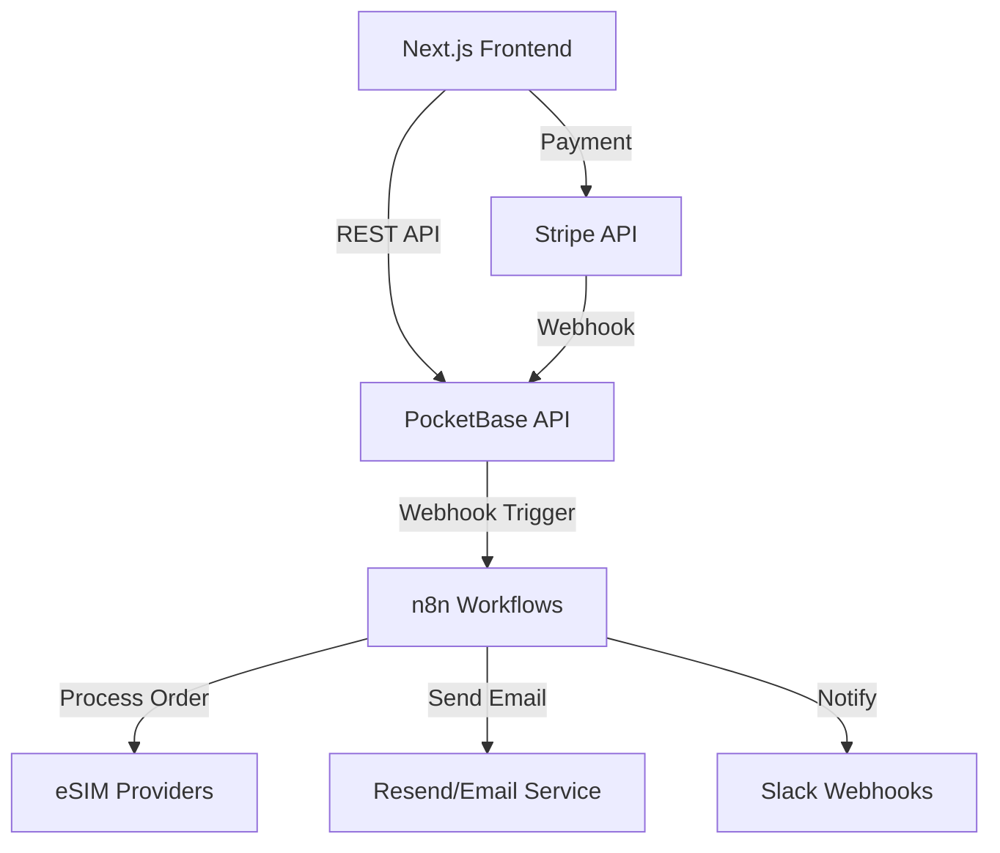

# Backend Design Specification

## 📋 Document Metadata

| 항목 | 내용 |
|------|------|
| **문서 유형** | Technical Specification |
| **대상 독자** | Backend 개발자, DevOps, 시스템 아키텍트 |
| **최종 수정** | 2024-12-01 |
| **버전** | 1.0.0 |
| **연관 문서** | [PRD.md](./PRD.md), [ARCHITECTURE.md](./ARCHITECTURE.md), [API_SPEC.md](./API_SPEC.md), [DATA_MODEL.md](./DATA_MODEL.md) |
| **우선순위** | ⭐⭐⭐ (Core) |

## 📚 Quick Links

- 📋 **[PRD.md](./PRD.md)** - Product Requirements Document
- 🏗️ **[ARCHITECTURE.md](./ARCHITECTURE.md)** - System Architecture
- 📡 **[API_SPEC.md](./API_SPEC.md)** - API Specification
- 🗄️ **[DATA_MODEL.md](./DATA_MODEL.md)** - Data Model & Schema
- 🎨 **[FRONTEND_SPEC.md](./FRONTEND_SPEC.md)** - Frontend Specification

---

## 📖 Table of Contents

1. [Backend Architecture Overview](#backend-architecture-overview)
2. [Technology Stack](#technology-stack)
3. [PocketBase Configuration](#pocketbase-configuration)
4. [PocketBase Hooks & Event Handlers](#pocketbase-hooks--event-handlers)
5. [n8n Workflow Automation](#n8n-workflow-automation)
6. [eSIM Provider Integrations](#esim-provider-integrations)
7. [Service Layer Patterns](#service-layer-patterns)
8. [Error Handling & Retry Strategies](#error-handling--retry-strategies)
9. [Security Architecture](#security-architecture)
10. [Performance Optimization](#performance-optimization)
11. [Monitoring & Logging](#monitoring--logging)
12. [Testing Strategy](#testing-strategy)

---

## Backend Architecture Overview

### High-Level Architecture



### Design Principles

1. **Automation-First**: n8n handles all business logic workflows
2. **Event-Driven**: PocketBase hooks trigger n8n workflows via webhooks
3. **Multi-Provider Resilience**: Failover logic for eSIM provider downtime
4. **Minimal Custom Code**: Leverage PocketBase + n8n instead of custom backend
5. **Idempotency**: All operations can be safely retried
6. **Observability**: Comprehensive logging and monitoring

---

## Technology Stack

### Core Backend Technologies

| Component | Technology | Version | Purpose |
|-----------|-----------|---------|---------|
| **Backend Framework** | PocketBase | 0.20+ | Database + API + Auth |
| **Workflow Engine** | n8n | 1.0+ | Business logic automation |
| **Database** | SQLite | 3.40+ | Embedded database (via PocketBase) |
| **Runtime** | Go | 1.21+ | PocketBase runtime |
| **Payment Gateway** | Stripe | Latest | Payment processing |
| **Email Service** | Resend | Latest | Transactional emails |
| **Notifications** | Slack API | v2 | Team notifications |

### eSIM Provider APIs

| Provider | Priority | Failover Order | API Version |
|----------|----------|----------------|-------------|
| **eSIM Card** | Primary | 1st | v2 |
| **MobiMatter** | Secondary | 2nd | v1 |
| **Airalo** | Tertiary | 3rd | v2 |

---

## PocketBase Configuration

### Collections Schema

Collections are defined in `pb_migrations/` directory. See [DATA_MODEL.md](./DATA_MODEL.md) for complete schema.

### Environment Variables

```bash
# PocketBase Configuration
PB_DATA_DIR=/app/pocketbase/pb_data
PB_ENCRYPTION_KEY=<generate-secure-key>
PB_PUBLIC_DIR=/app/pocketbase/pb_public

# API URLs
API_BASE_URL=https://api.numnaroad.com
FRONTEND_URL=https://numnaroad.com
N8N_WEBHOOK_URL=https://n8n.numnaroad.com/webhook

# External Services
STRIPE_SECRET_KEY=sk_live_...
STRIPE_WEBHOOK_SECRET=whsec_...
RESEND_API_KEY=re_...
SLACK_WEBHOOK_URL=https://hooks.slack.com/services/...

# eSIM Providers
ESIM_CARD_API_KEY=...
ESIM_CARD_API_URL=https://api.esim-card.com/v2
MOBIMATTER_API_KEY=...
MOBIMATTER_API_URL=https://api.mobimatter.com/v1
AIRALO_API_KEY=...
AIRALO_API_URL=https://api.airalo.com/v2

# Feature Flags
ENABLE_MULTI_PROVIDER_FAILOVER=true
ENABLE_AUTO_REFUND=true
MAX_RETRY_ATTEMPTS=3
PROVIDER_TIMEOUT_MS=30000
```

### PocketBase Initialization

```go
// main.go
package main

import (
    "log"
    "os"

    "github.com/pocketbase/pocketbase"
    "github.com/pocketbase/pocketbase/core"
)

func main() {
    app := pocketbase.New()

    // Load environment variables
    loadEnvVars(app)

    // Register hooks
    registerOrderHooks(app)
    registerPaymentHooks(app)
    registerProviderHooks(app)

    // Start server
    if err := app.Start(); err != nil {
        log.Fatal(err)
    }
}

func loadEnvVars(app *pocketbase.PocketBase) {
    app.OnBeforeServe().Add(func(e *core.ServeEvent) error {
        // Validate required env vars
        requiredVars := []string{
            "STRIPE_SECRET_KEY",
            "N8N_WEBHOOK_URL",
            "ESIM_CARD_API_KEY",
        }

        for _, v := range requiredVars {
            if os.Getenv(v) == "" {
                log.Fatalf("Missing required env var: %s", v)
            }
        }

        return nil
    })
}
```

---

## PocketBase Hooks & Event Handlers

### Order Creation Hook

**Trigger**: After `orders` record is created
**Action**: Trigger n8n workflow to process eSIM purchase

```go
// hooks/orders.go
package hooks

import (
    "bytes"
    "encoding/json"
    "net/http"
    "os"

    "github.com/pocketbase/pocketbase"
    "github.com/pocketbase/pocketbase/core"
    "github.com/pocketbase/pocketbase/models"
)

func registerOrderHooks(app *pocketbase.PocketBase) {
    app.OnRecordAfterCreateRequest("orders").Add(func(e *core.RecordCreateEvent) error {
        order := e.Record

        // Only trigger for new paid orders
        if order.GetString("status") != "pending" {
            return nil
        }

        // Prepare webhook payload
        payload := map[string]interface{}{
            "orderId":     order.Id,
            "productId":   order.GetString("product"),
            "customerId":  order.GetString("customer"),
            "amount":      order.GetFloat("amount"),
            "country":     order.GetString("country"),
            "email":       order.GetString("customer_email"),
            "phone":       order.GetString("customer_phone"),
            "createdAt":   order.GetDateTime("created").String(),
        }

        // Send to n8n webhook
        return triggerN8NWorkflow("order-created", payload)
    })
}

func triggerN8NWorkflow(workflow string, payload map[string]interface{}) error {
    webhookURL := os.Getenv("N8N_WEBHOOK_URL") + "/" + workflow

    jsonData, err := json.Marshal(payload)
    if err != nil {
        return err
    }

    resp, err := http.Post(
        webhookURL,
        "application/json",
        bytes.NewBuffer(jsonData),
    )
    if err != nil {
        return err
    }
    defer resp.Body.Close()

    if resp.StatusCode != 200 {
        return fmt.Errorf("n8n webhook failed: %d", resp.StatusCode)
    }

    return nil
}
```

### Payment Webhook Handler

**Trigger**: Stripe webhook received
**Action**: Update order status and trigger fulfillment

```go
// hooks/payments.go
package hooks

import (
    "encoding/json"
    "io"
    "net/http"
    "os"

    "github.com/pocketbase/pocketbase"
    "github.com/pocketbase/pocketbase/apis"
    "github.com/stripe/stripe-go/v76"
    "github.com/stripe/stripe-go/v76/webhook"
)

func registerPaymentHooks(app *pocketbase.PocketBase) {
    app.OnBeforeServe().Add(func(e *core.ServeEvent) error {
        // Custom route for Stripe webhooks
        e.Router.POST("/api/webhooks/stripe", func(c echo.Context) error {
            payload, err := io.ReadAll(c.Request().Body)
            if err != nil {
                return c.JSON(http.StatusBadRequest, map[string]string{
                    "error": "Invalid payload",
                })
            }

            // Verify webhook signature
            event, err := webhook.ConstructEvent(
                payload,
                c.Request().Header.Get("Stripe-Signature"),
                os.Getenv("STRIPE_WEBHOOK_SECRET"),
            )
            if err != nil {
                return c.JSON(http.StatusBadRequest, map[string]string{
                    "error": "Invalid signature",
                })
            }

            // Handle event
            switch event.Type {
            case "checkout.session.completed":
                return handleCheckoutCompleted(app, event)
            case "payment_intent.succeeded":
                return handlePaymentSucceeded(app, event)
            case "payment_intent.payment_failed":
                return handlePaymentFailed(app, event)
            }

            return c.JSON(http.StatusOK, map[string]bool{"received": true})
        })

        return nil
    })
}

func handleCheckoutCompleted(app *pocketbase.PocketBase, event stripe.Event) error {
    var session stripe.CheckoutSession
    if err := json.Unmarshal(event.Data.Raw, &session); err != nil {
        return err
    }

    // Get order by session metadata
    orderId := session.Metadata["order_id"]
    order, err := app.Dao().FindRecordById("orders", orderId)
    if err != nil {
        return err
    }

    // Update order status
    order.Set("status", "processing")
    order.Set("stripe_session_id", session.ID)
    order.Set("stripe_payment_intent", session.PaymentIntent.ID)

    if err := app.Dao().SaveRecord(order); err != nil {
        return err
    }

    // Trigger n8n workflow to provision eSIM
    return triggerN8NWorkflow("esim-provision", map[string]interface{}{
        "orderId": orderId,
    })
}
```

### Provider Failover Hook

**Trigger**: eSIM provider API failure
**Action**: Automatically retry with next provider

```go
// hooks/providers.go
package hooks

func registerProviderHooks(app *pocketbase.PocketBase) {
    app.OnRecordAfterUpdateRequest("automation_logs").Add(func(e *core.RecordUpdateEvent) error {
        log := e.Record

        // Check if this is a provider failure
        if log.GetString("status") != "failed" {
            return nil
        }

        workflow := log.GetString("workflow_name")
        if workflow != "esim-provision" {
            return nil
        }

        // Get order
        orderId := log.GetString("order_id")
        order, err := app.Dao().FindRecordById("orders", orderId)
        if err != nil {
            return err
        }

        // Check retry count
        retryCount := log.GetInt("retry_count")
        maxRetries := 3

        if retryCount < maxRetries {
            // Trigger n8n failover workflow
            return triggerN8NWorkflow("esim-provision-failover", map[string]interface{}{
                "orderId":      orderId,
                "retryCount":   retryCount + 1,
                "lastProvider": log.GetString("provider_name"),
            })
        }

        // Max retries exceeded - send alert
        return triggerN8NWorkflow("order-failed-alert", map[string]interface{}{
            "orderId": orderId,
            "reason":  "All providers failed",
        })
    })
}
```

---

## n8n Workflow Automation

### Workflow Architecture

n8n handles all business logic through event-driven workflows triggered by PocketBase webhooks.

### Workflow 1: Order Created → eSIM Provision

**Trigger**: PocketBase webhook after order creation
**Steps**:
1. Receive order data from webhook
2. Validate order details
3. Call eSIM provider API (with failover)
4. Store eSIM data (ICCID, QR code)
5. Send confirmation email with QR code
6. Update order status to "completed"
7. Log automation result

**n8n Workflow JSON**:

```json
{
  "name": "Order Created - eSIM Provision",
  "nodes": [
    {
      "parameters": {
        "httpMethod": "POST",
        "path": "order-created",
        "responseMode": "onReceived",
        "options": {}
      },
      "name": "Webhook",
      "type": "n8n-nodes-base.webhook",
      "position": [250, 300]
    },
    {
      "parameters": {
        "conditions": {
          "string": [
            {
              "value1": "={{$json.orderId}}",
              "operation": "isNotEmpty"
            }
          ]
        }
      },
      "name": "Validate Order",
      "type": "n8n-nodes-base.if",
      "position": [450, 300]
    },
    {
      "parameters": {
        "url": "={{$env.ESIM_CARD_API_URL}}/orders",
        "authentication": "genericCredentialType",
        "genericAuthType": "httpHeaderAuth",
        "sendHeaders": true,
        "headerParameters": {
          "parameters": [
            {
              "name": "X-API-Key",
              "value": "={{$env.ESIM_CARD_API_KEY}}"
            }
          ]
        },
        "sendBody": true,
        "bodyParameters": {
          "parameters": [
            {
              "name": "product_id",
              "value": "={{$json.productId}}"
            },
            {
              "name": "email",
              "value": "={{$json.email}}"
            },
            {
              "name": "quantity",
              "value": "1"
            }
          ]
        },
        "options": {
          "timeout": 30000
        }
      },
      "name": "Call eSIM Card API",
      "type": "n8n-nodes-base.httpRequest",
      "position": [650, 300],
      "continueOnFail": true
    },
    {
      "parameters": {
        "conditions": {
          "number": [
            {
              "value1": "={{$json.statusCode}}",
              "operation": "equal",
              "value2": 200
            }
          ]
        }
      },
      "name": "Check API Success",
      "type": "n8n-nodes-base.if",
      "position": [850, 300]
    },
    {
      "parameters": {
        "url": "={{$env.API_BASE_URL}}/api/collections/orders/records/{{$('Webhook').item.json.orderId}}",
        "method": "PATCH",
        "sendHeaders": true,
        "headerParameters": {
          "parameters": [
            {
              "name": "Content-Type",
              "value": "application/json"
            }
          ]
        },
        "sendBody": true,
        "bodyParameters": {
          "parameters": [
            {
              "name": "status",
              "value": "completed"
            },
            {
              "name": "esim_iccid",
              "value": "={{$json.data.iccid}}"
            },
            {
              "name": "esim_qr_code",
              "value": "={{$json.data.qr_code_url}}"
            },
            {
              "name": "esim_activation_code",
              "value": "={{$json.data.activation_code}}"
            },
            {
              "name": "provider_order_id",
              "value": "={{$json.data.order_id}}"
            },
            {
              "name": "provider_name",
              "value": "eSIM Card"
            }
          ]
        }
      },
      "name": "Update Order - Success",
      "type": "n8n-nodes-base.httpRequest",
      "position": [1050, 200]
    },
    {
      "parameters": {
        "url": "={{$env.RESEND_API_URL}}/emails",
        "authentication": "genericCredentialType",
        "genericAuthType": "httpHeaderAuth",
        "sendHeaders": true,
        "headerParameters": {
          "parameters": [
            {
              "name": "Authorization",
              "value": "Bearer {{$env.RESEND_API_KEY}}"
            }
          ]
        },
        "sendBody": true,
        "bodyParameters": {
          "parameters": [
            {
              "name": "from",
              "value": "NumnaRoad <orders@numnaroad.com>"
            },
            {
              "name": "to",
              "value": "={{$('Webhook').item.json.email}}"
            },
            {
              "name": "subject",
              "value": "Your eSIM is Ready! 🎉"
            },
            {
              "name": "html",
              "value": "<html>...</html>"
            }
          ]
        }
      },
      "name": "Send Success Email",
      "type": "n8n-nodes-base.httpRequest",
      "position": [1250, 200]
    },
    {
      "parameters": {
        "url": "={{$env.SLACK_WEBHOOK_URL}}",
        "sendBody": true,
        "bodyParameters": {
          "parameters": [
            {
              "name": "text",
              "value": "✅ Order {{$('Webhook').item.json.orderId}} completed successfully"
            }
          ]
        }
      },
      "name": "Notify Slack - Success",
      "type": "n8n-nodes-base.httpRequest",
      "position": [1450, 200]
    },
    {
      "parameters": {
        "functionCode": "// Trigger failover to MobiMatter\nreturn {\n  orderId: items[0].json.orderId,\n  retryCount: 1,\n  lastProvider: 'eSIM Card'\n};"
      },
      "name": "Prepare Failover",
      "type": "n8n-nodes-base.function",
      "position": [1050, 400]
    },
    {
      "parameters": {
        "url": "={{$env.N8N_WEBHOOK_URL}}/esim-provision-failover",
        "method": "POST",
        "sendBody": true,
        "bodyParameters": {
          "parameters": [
            {
              "name": "orderId",
              "value": "={{$json.orderId}}"
            },
            {
              "name": "retryCount",
              "value": "={{$json.retryCount}}"
            },
            {
              "name": "lastProvider",
              "value": "={{$json.lastProvider}}"
            }
          ]
        }
      },
      "name": "Trigger Failover Workflow",
      "type": "n8n-nodes-base.httpRequest",
      "position": [1250, 400]
    }
  ],
  "connections": {
    "Webhook": {
      "main": [[{ "node": "Validate Order", "type": "main", "index": 0 }]]
    },
    "Validate Order": {
      "main": [
        [{ "node": "Call eSIM Card API", "type": "main", "index": 0 }]
      ]
    },
    "Call eSIM Card API": {
      "main": [[{ "node": "Check API Success", "type": "main", "index": 0 }]]
    },
    "Check API Success": {
      "main": [
        [{ "node": "Update Order - Success", "type": "main", "index": 0 }],
        [{ "node": "Prepare Failover", "type": "main", "index": 0 }]
      ]
    },
    "Update Order - Success": {
      "main": [[{ "node": "Send Success Email", "type": "main", "index": 0 }]]
    },
    "Send Success Email": {
      "main": [[{ "node": "Notify Slack - Success", "type": "main", "index": 0 }]]
    },
    "Prepare Failover": {
      "main": [[{ "node": "Trigger Failover Workflow", "type": "main", "index": 0 }]]
    }
  }
}
```

### Workflow 2: eSIM Provision Failover

**Trigger**: Primary provider API failure
**Logic**: Try providers in order: eSIM Card → MobiMatter → Airalo

```javascript
// n8n Function Node: Provider Failover Logic
const orderId = $input.item.json.orderId;
const retryCount = $input.item.json.retryCount || 0;
const lastProvider = $input.item.json.lastProvider || '';

// Provider priority list
const providers = [
  { name: 'eSIM Card', url: $env.ESIM_CARD_API_URL, key: $env.ESIM_CARD_API_KEY },
  { name: 'MobiMatter', url: $env.MOBIMATTER_API_URL, key: $env.MOBIMATTER_API_KEY },
  { name: 'Airalo', url: $env.AIRALO_API_URL, key: $env.AIRALO_API_KEY }
];

// Find next provider to try
let nextProviderIndex = 0;
if (lastProvider) {
  const lastIndex = providers.findIndex(p => p.name === lastProvider);
  nextProviderIndex = lastIndex + 1;
}

// Check if we've exhausted all providers
if (nextProviderIndex >= providers.length) {
  return {
    success: false,
    orderId,
    error: 'All providers failed',
    action: 'send-failure-notification'
  };
}

const nextProvider = providers[nextProviderIndex];

return {
  success: true,
  orderId,
  provider: nextProvider,
  retryCount: retryCount + 1
};
```

### Workflow 3: Payment Failed → Refund & Notify

**Trigger**: Stripe payment failure webhook
**Steps**:
1. Update order status to "failed"
2. Create refund in Stripe (if applicable)
3. Send apology email to customer
4. Notify team on Slack

### Workflow 4: Daily Stock Sync

**Trigger**: Cron schedule (every 6 hours)
**Steps**:
1. For each active product, check provider stock levels
2. Update `esim_products.stock` field
3. Send low-stock alerts if stock < 10
4. Mark products as out-of-stock if stock = 0

### Workflow 5: Order Status Reminder

**Trigger**: Cron schedule (every 1 hour)
**Steps**:
1. Find orders stuck in "processing" for > 1 hour
2. Check provider order status via API
3. Update order status accordingly
4. Send alert if order is truly stuck

---

## eSIM Provider Integrations

### Provider API Abstraction Layer

Create unified interface for all providers to simplify failover logic.

```typescript
// types/esim-provider.ts
export interface eSIMProviderConfig {
  name: string;
  apiUrl: string;
  apiKey: string;
  timeout: number;
}

export interface eSIMOrderRequest {
  productId: string;
  email: string;
  phone?: string;
  quantity: number;
}

export interface eSIMOrderResponse {
  success: boolean;
  orderId: string;
  iccid: string;
  qrCodeUrl: string;
  activationCode: string;
  error?: string;
}

export interface eSIMProvider {
  name: string;
  createOrder(request: eSIMOrderRequest): Promise<eSIMOrderResponse>;
  getOrderStatus(orderId: string): Promise<eSIMOrderResponse>;
  cancelOrder(orderId: string): Promise<boolean>;
}
```

### eSIM Card Provider Implementation

```typescript
// providers/esim-card.ts
import axios, { AxiosInstance } from 'axios';

export class eSIMCardProvider implements eSIMProvider {
  name = 'eSIM Card';
  private client: AxiosInstance;

  constructor(config: eSIMProviderConfig) {
    this.client = axios.create({
      baseURL: config.apiUrl,
      timeout: config.timeout,
      headers: {
        'X-API-Key': config.apiKey,
        'Content-Type': 'application/json',
      },
    });
  }

  async createOrder(request: eSIMOrderRequest): Promise<eSIMOrderResponse> {
    try {
      const response = await this.client.post('/orders', {
        product_id: request.productId,
        email: request.email,
        quantity: request.quantity,
      });

      return {
        success: true,
        orderId: response.data.order_id,
        iccid: response.data.iccid,
        qrCodeUrl: response.data.qr_code_url,
        activationCode: response.data.activation_code,
      };
    } catch (error) {
      return {
        success: false,
        orderId: '',
        iccid: '',
        qrCodeUrl: '',
        activationCode: '',
        error: error.response?.data?.message || error.message,
      };
    }
  }

  async getOrderStatus(orderId: string): Promise<eSIMOrderResponse> {
    const response = await this.client.get(`/orders/${orderId}`);

    return {
      success: response.data.status === 'completed',
      orderId: response.data.order_id,
      iccid: response.data.iccid,
      qrCodeUrl: response.data.qr_code_url,
      activationCode: response.data.activation_code,
    };
  }

  async cancelOrder(orderId: string): Promise<boolean> {
    try {
      await this.client.delete(`/orders/${orderId}`);
      return true;
    } catch (error) {
      return false;
    }
  }
}
```

### MobiMatter Provider Implementation

```typescript
// providers/mobimatter.ts
export class MobiMatterProvider implements eSIMProvider {
  name = 'MobiMatter';
  private client: AxiosInstance;

  constructor(config: eSIMProviderConfig) {
    this.client = axios.create({
      baseURL: config.apiUrl,
      timeout: config.timeout,
      headers: {
        'Authorization': `Bearer ${config.apiKey}`,
        'Content-Type': 'application/json',
      },
    });
  }

  async createOrder(request: eSIMOrderRequest): Promise<eSIMOrderResponse> {
    try {
      // MobiMatter has different API structure
      const response = await this.client.post('/v1/esim/purchase', {
        package_id: request.productId,
        customer_email: request.email,
        qty: request.quantity,
      });

      return {
        success: true,
        orderId: response.data.transaction_id,
        iccid: response.data.esim.iccid,
        qrCodeUrl: response.data.esim.qr_image,
        activationCode: response.data.esim.manual_code,
      };
    } catch (error) {
      return {
        success: false,
        orderId: '',
        iccid: '',
        qrCodeUrl: '',
        activationCode: '',
        error: error.response?.data?.error || error.message,
      };
    }
  }

  // ... implement other methods
}
```

### Airalo Provider Implementation

```typescript
// providers/airalo.ts
export class AiraloProvider implements eSIMProvider {
  name = 'Airalo';
  private client: AxiosInstance;

  constructor(config: eSIMProviderConfig) {
    this.client = axios.create({
      baseURL: config.apiUrl,
      timeout: config.timeout,
      headers: {
        'Authorization': `Bearer ${config.apiKey}`,
        'Accept': 'application/json',
      },
    });
  }

  async createOrder(request: eSIMOrderRequest): Promise<eSIMOrderResponse> {
    try {
      // Airalo uses different field names
      const response = await this.client.post('/orders', {
        package_id: request.productId,
        quantity: request.quantity,
        type: 'sim',
        description: `Order for ${request.email}`,
      });

      return {
        success: true,
        orderId: response.data.id,
        iccid: response.data.sims[0].iccid,
        qrCodeUrl: response.data.sims[0].qrcode,
        activationCode: response.data.sims[0].lpa,
      };
    } catch (error) {
      return {
        success: false,
        orderId: '',
        iccid: '',
        qrCodeUrl: '',
        activationCode: '',
        error: error.response?.data?.message || error.message,
      };
    }
  }

  // ... implement other methods
}
```

### Provider Factory

```typescript
// providers/factory.ts
export class ProviderFactory {
  static createProvider(config: eSIMProviderConfig): eSIMProvider {
    switch (config.name) {
      case 'eSIM Card':
        return new eSIMCardProvider(config);
      case 'MobiMatter':
        return new MobiMatterProvider(config);
      case 'Airalo':
        return new AiraloProvider(config);
      default:
        throw new Error(`Unknown provider: ${config.name}`);
    }
  }

  static createAllProviders(): eSIMProvider[] {
    const providers = [
      { name: 'eSIM Card', apiUrl: process.env.ESIM_CARD_API_URL, apiKey: process.env.ESIM_CARD_API_KEY, timeout: 30000 },
      { name: 'MobiMatter', apiUrl: process.env.MOBIMATTER_API_URL, apiKey: process.env.MOBIMATTER_API_KEY, timeout: 30000 },
      { name: 'Airalo', apiUrl: process.env.AIRALO_API_URL, apiKey: process.env.AIRALO_API_KEY, timeout: 30000 },
    ];

    return providers.map(config => ProviderFactory.createProvider(config));
  }
}
```

---

## Service Layer Patterns

### Repository Pattern for Data Access

```typescript
// services/order-repository.ts
import PocketBase from 'pocketbase';

export class OrderRepository {
  constructor(private pb: PocketBase) {}

  async findById(id: string) {
    return await this.pb.collection('orders').getOne(id, {
      expand: 'product,customer',
    });
  }

  async create(data: OrderCreateData) {
    return await this.pb.collection('orders').create(data);
  }

  async updateStatus(id: string, status: OrderStatus) {
    return await this.pb.collection('orders').update(id, { status });
  }

  async findPendingOrders() {
    return await this.pb.collection('orders').getFullList({
      filter: 'status = "pending"',
      sort: '-created',
    });
  }

  async findStuckOrders(hoursThreshold: number = 1) {
    const threshold = new Date(Date.now() - hoursThreshold * 60 * 60 * 1000);

    return await this.pb.collection('orders').getFullList({
      filter: `status = "processing" && updated < "${threshold.toISOString()}"`,
    });
  }
}
```

### Service Layer for Business Logic

```typescript
// services/order-service.ts
export class OrderService {
  constructor(
    private orderRepo: OrderRepository,
    private providers: eSIMProvider[]
  ) {}

  async processOrder(orderId: string): Promise<ProcessOrderResult> {
    const order = await this.orderRepo.findById(orderId);

    // Try each provider in sequence
    for (const provider of this.providers) {
      try {
        const result = await provider.createOrder({
          productId: order.product,
          email: order.customer_email,
          phone: order.customer_phone,
          quantity: 1,
        });

        if (result.success) {
          // Update order with eSIM details
          await this.orderRepo.updateStatus(orderId, 'completed');
          await this.orderRepo.update(orderId, {
            esim_iccid: result.iccid,
            esim_qr_code: result.qrCodeUrl,
            esim_activation_code: result.activationCode,
            provider_order_id: result.orderId,
            provider_name: provider.name,
          });

          return {
            success: true,
            provider: provider.name,
            esimData: result,
          };
        }
      } catch (error) {
        console.error(`Provider ${provider.name} failed:`, error);
        // Continue to next provider
      }
    }

    // All providers failed
    await this.orderRepo.updateStatus(orderId, 'failed');
    return {
      success: false,
      error: 'All providers failed',
    };
  }
}
```

---

## Error Handling & Retry Strategies

### Error Classification

```typescript
// types/errors.ts
export enum ErrorType {
  PROVIDER_TIMEOUT = 'PROVIDER_TIMEOUT',
  PROVIDER_API_ERROR = 'PROVIDER_API_ERROR',
  PROVIDER_OUT_OF_STOCK = 'PROVIDER_OUT_OF_STOCK',
  INVALID_PRODUCT = 'INVALID_PRODUCT',
  PAYMENT_FAILED = 'PAYMENT_FAILED',
  NETWORK_ERROR = 'NETWORK_ERROR',
  UNKNOWN_ERROR = 'UNKNOWN_ERROR',
}

export interface AppError {
  type: ErrorType;
  message: string;
  retryable: boolean;
  statusCode: number;
  metadata?: Record<string, any>;
}
```

### Retry Strategy with Exponential Backoff

```typescript
// utils/retry.ts
export async function retryWithBackoff<T>(
  fn: () => Promise<T>,
  options: {
    maxRetries: number;
    initialDelay: number;
    maxDelay: number;
    backoffFactor: number;
  }
): Promise<T> {
  let lastError: Error;
  let delay = options.initialDelay;

  for (let attempt = 0; attempt <= options.maxRetries; attempt++) {
    try {
      return await fn();
    } catch (error) {
      lastError = error;

      if (attempt === options.maxRetries) {
        break;
      }

      // Wait before retry
      await sleep(delay);

      // Exponential backoff
      delay = Math.min(delay * options.backoffFactor, options.maxDelay);
    }
  }

  throw lastError;
}

// Usage in n8n workflow
const result = await retryWithBackoff(
  () => callProviderAPI(order),
  {
    maxRetries: 3,
    initialDelay: 1000,
    maxDelay: 10000,
    backoffFactor: 2,
  }
);
```

### Circuit Breaker Pattern

```typescript
// utils/circuit-breaker.ts
export class CircuitBreaker {
  private failureCount = 0;
  private lastFailureTime: Date | null = null;
  private state: 'CLOSED' | 'OPEN' | 'HALF_OPEN' = 'CLOSED';

  constructor(
    private threshold: number,
    private timeout: number
  ) {}

  async execute<T>(fn: () => Promise<T>): Promise<T> {
    if (this.state === 'OPEN') {
      if (Date.now() - this.lastFailureTime!.getTime() > this.timeout) {
        this.state = 'HALF_OPEN';
      } else {
        throw new Error('Circuit breaker is OPEN');
      }
    }

    try {
      const result = await fn();
      this.onSuccess();
      return result;
    } catch (error) {
      this.onFailure();
      throw error;
    }
  }

  private onSuccess() {
    this.failureCount = 0;
    this.state = 'CLOSED';
  }

  private onFailure() {
    this.failureCount++;
    this.lastFailureTime = new Date();

    if (this.failureCount >= this.threshold) {
      this.state = 'OPEN';
    }
  }
}

// Usage
const breaker = new CircuitBreaker(5, 60000); // 5 failures, 60s timeout
const result = await breaker.execute(() => provider.createOrder(request));
```

---

## Security Architecture

### API Security

1. **Authentication**:
   - JWT tokens for user sessions
   - API keys for n8n webhooks
   - Stripe webhook signature verification

2. **Authorization**:
   - PocketBase rules enforce user permissions
   - Admin-only routes for sensitive operations

3. **Rate Limiting**:
```go
// PocketBase rate limiting middleware
app.OnBeforeServe().Add(func(e *core.ServeEvent) error {
    e.Router.Use(middleware.RateLimiter(middleware.RateLimiterConfig{
        Max:      100,
        Duration: 1 * time.Minute,
    }))
    return nil
})
```

4. **Input Validation**:
   - PocketBase schema validation
   - Zod validation on frontend
   - SQL injection prevention (PocketBase handles)

### Environment Variables Security

```bash
# Never commit these files
.env
.env.local
.env.production

# Store secrets in:
# - Production: Docker secrets / Kubernetes secrets
# - Development: .env.local (gitignored)
```

### CORS Configuration

```go
// PocketBase CORS settings
app.OnBeforeServe().Add(func(e *core.ServeEvent) error {
    e.Router.Use(middleware.CORSWithConfig(middleware.CORSConfig{
        AllowOrigins: []string{
            "https://numnaroad.com",
            "https://www.numnaroad.com",
            "http://localhost:3000", // Dev only
        },
        AllowMethods: []string{"GET", "POST", "PUT", "PATCH", "DELETE"},
        AllowHeaders: []string{"Content-Type", "Authorization"},
    }))
    return nil
})
```

---

## Performance Optimization

### Database Optimization

1. **Indexes** (see [DATA_MODEL.md](./DATA_MODEL.md)):
   - `orders.status`
   - `orders.customer_email`
   - `esim_products.country`
   - `automation_logs.created`

2. **Query Optimization**:
```sql
-- Good: Use indexes
SELECT * FROM orders WHERE status = 'pending' ORDER BY created DESC LIMIT 50;

-- Bad: Full table scan
SELECT * FROM orders WHERE customer_email LIKE '%@gmail.com';
```

3. **Connection Pooling**:
```go
// PocketBase handles SQLite connection pooling automatically
// For high load, consider moving to PostgreSQL
```

### Caching Strategy

1. **Products Cache** (Frontend):
```typescript
// React Query with 5-minute cache
const { data: products } = useQuery({
  queryKey: ['products', country],
  queryFn: () => getProducts(country),
  staleTime: 5 * 60 * 1000, // 5 minutes
  cacheTime: 10 * 60 * 1000, // 10 minutes
});
```

2. **API Response Cache** (PocketBase):
```go
// Add ETag headers for caching
app.OnRecordAfterFindRequest("esim_products").Add(func(e *core.RecordRequestEvent) error {
    e.HttpContext.Response().Header().Set("Cache-Control", "public, max-age=300")
    return nil
})
```

### Background Jobs

```yaml
# docker-compose.yml
services:
  n8n:
    image: n8nio/n8n:latest
    environment:
      - N8N_QUEUE_MODE=redis
      - QUEUE_BULL_REDIS_HOST=redis
    depends_on:
      - redis

  redis:
    image: redis:7-alpine
    volumes:
      - redis_data:/data
```

---

## Monitoring & Logging

### Application Logging

```go
// PocketBase logging
import "github.com/pocketbase/pocketbase/core"

app.OnRecordAfterCreateRequest().Add(func(e *core.RecordCreateEvent) error {
    app.Logger().Info(
        "Record created",
        "collection", e.Record.Collection().Name,
        "id", e.Record.Id,
    )
    return nil
})
```

### Error Tracking (Sentry Integration)

```typescript
// n8n workflow error handler
import * as Sentry from '@sentry/node';

Sentry.init({
  dsn: process.env.SENTRY_DSN,
  environment: process.env.NODE_ENV,
});

try {
  await processOrder(orderId);
} catch (error) {
  Sentry.captureException(error, {
    tags: {
      workflow: 'esim-provision',
      orderId,
    },
  });
  throw error;
}
```

### Metrics & Alerts

```yaml
# alerts.yml (for Prometheus/Grafana)
groups:
  - name: numnaroad_alerts
    interval: 1m
    rules:
      - alert: HighOrderFailureRate
        expr: (sum(rate(orders_failed_total[5m])) / sum(rate(orders_total[5m]))) > 0.1
        for: 5m
        labels:
          severity: critical
        annotations:
          summary: "Order failure rate > 10%"
          description: "{{ $value }}% of orders are failing"

      - alert: ProviderDown
        expr: provider_api_up == 0
        for: 2m
        labels:
          severity: warning
        annotations:
          summary: "eSIM provider {{ $labels.provider }} is down"

      - alert: StuckOrders
        expr: count(orders{status="processing", updated_minutes_ago > 60}) > 0
        for: 10m
        labels:
          severity: warning
        annotations:
          summary: "{{ $value }} orders stuck in processing"
```

### Logging Best Practices

1. **Structured Logging**:
```typescript
logger.info('Order processed', {
  orderId: '123',
  provider: 'eSIM Card',
  duration: 1234,
  status: 'success',
});
```

2. **Log Levels**:
   - `DEBUG`: Detailed debugging information
   - `INFO`: General informational messages
   - `WARN`: Warning messages (recoverable errors)
   - `ERROR`: Error messages (unrecoverable errors)

3. **PII Protection**: Never log sensitive data (emails, phone numbers, payment info)

---

## Testing Strategy

### Unit Tests (Provider Logic)

```typescript
// providers/__tests__/esim-card.test.ts
import { describe, it, expect, vi } from 'vitest';
import { eSIMCardProvider } from '../esim-card';

describe('eSIMCardProvider', () => {
  it('should create order successfully', async () => {
    const provider = new eSIMCardProvider({
      name: 'eSIM Card',
      apiUrl: 'https://api.test.com',
      apiKey: 'test-key',
      timeout: 5000,
    });

    // Mock axios
    vi.mock('axios', () => ({
      create: vi.fn(() => ({
        post: vi.fn().mockResolvedValue({
          data: {
            order_id: '123',
            iccid: '8901234567890',
            qr_code_url: 'https://example.com/qr.png',
            activation_code: 'LPA:1234',
          },
        }),
      })),
    }));

    const result = await provider.createOrder({
      productId: 'prod-123',
      email: 'test@example.com',
      quantity: 1,
    });

    expect(result.success).toBe(true);
    expect(result.orderId).toBe('123');
    expect(result.iccid).toBe('8901234567890');
  });

  it('should handle API errors gracefully', async () => {
    // Test error handling
  });
});
```

### Integration Tests (PocketBase Hooks)

```go
// hooks_test.go
package hooks_test

import (
    "testing"
    "github.com/pocketbase/pocketbase/tests"
)

func TestOrderCreationTriggersWebhook(t *testing.T) {
    app := tests.NewTestApp()
    defer app.Cleanup()

    // Create test order
    order := &models.Record{}
    order.Set("status", "pending")
    order.Set("amount", 10.0)

    err := app.Dao().SaveRecord(order)
    if err != nil {
        t.Fatal(err)
    }

    // Assert webhook was triggered (check logs or mock webhook server)
}
```

### End-to-End Tests (n8n Workflows)

```typescript
// e2e/__tests__/order-flow.test.ts
import { test, expect } from '@playwright/test';

test('complete order flow', async ({ page }) => {
  // 1. Go to product page
  await page.goto('https://numnaroad.com/products/japan');

  // 2. Add to cart
  await page.click('[data-testid="add-to-cart"]');

  // 3. Checkout
  await page.click('[data-testid="checkout"]');
  await page.fill('[name="email"]', 'test@example.com');
  await page.fill('[name="phone"]', '+821012345678');

  // 4. Pay with Stripe test card
  await page.click('[data-testid="pay-now"]');
  const stripeFrame = page.frameLocator('iframe[name^="__privateStripeFrame"]');
  await stripeFrame.locator('[placeholder="Card number"]').fill('4242424242424242');
  await stripeFrame.locator('[placeholder="MM / YY"]').fill('12/25');
  await stripeFrame.locator('[placeholder="CVC"]').fill('123');
  await page.click('[data-testid="submit-payment"]');

  // 5. Verify success page
  await expect(page).toHaveURL(/\/success/);
  await expect(page.locator('h1')).toContainText('Order Complete');

  // 6. Check email (using test email service)
  // ...
});
```

---

## Appendix

### Useful Commands

```bash
# Start PocketBase
./pocketbase serve --http="0.0.0.0:8090"

# PocketBase with custom hooks
go run main.go serve

# n8n development mode
docker-compose up n8n

# Check n8n workflows
curl http://localhost:5678/rest/workflows

# Test Stripe webhook locally
stripe listen --forward-to localhost:8090/api/webhooks/stripe

# Database backup
sqlite3 pb_data/data.db ".backup './backups/backup_$(date +%Y%m%d).db'"

# View logs
docker-compose logs -f pocketbase
docker-compose logs -f n8n
```

### Environment Setup Checklist

- [ ] PocketBase installed and configured
- [ ] n8n installed and connected to PocketBase
- [ ] Stripe account created and API keys obtained
- [ ] Resend account created for emails
- [ ] Slack webhook URL configured
- [ ] eSIM provider API keys obtained (all 3 providers)
- [ ] Environment variables set in `.env`
- [ ] Database migrations applied
- [ ] n8n workflows imported
- [ ] SSL certificates configured (production)
- [ ] Domain DNS configured
- [ ] Monitoring/logging set up

### Related Documentation

- **[PRD.md](./PRD.md)**: Product requirements and user stories
- **[ARCHITECTURE.md](./ARCHITECTURE.md)**: System architecture overview
- **[API_SPEC.md](./API_SPEC.md)**: Complete API specification
- **[DATA_MODEL.md](./DATA_MODEL.md)**: Database schema and data integrity
- **[FRONTEND_SPEC.md](./FRONTEND_SPEC.md)**: Frontend component architecture

---

**Document Version**: 1.0.0
**Last Updated**: 2024-12-01
**Maintained By**: NumnaRoad Engineering Team
